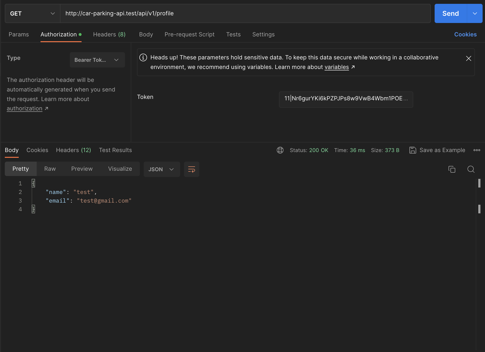
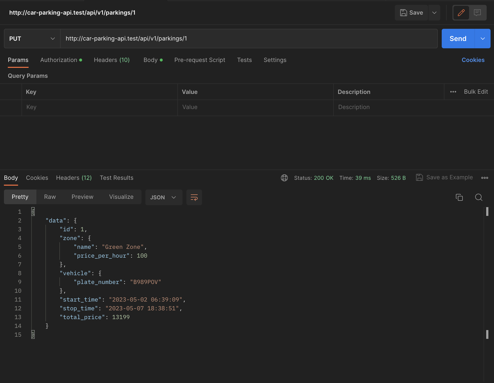

# Car Parking API using Laravel

## Screenshots

<div>
    </img> 
    </img> 
    </img> 
    </img> 
    </img> 
    </img> 
    </img> 
    </img> 
    </img> 
    </img> 
    </img> 
    </img> 
    </img> 
    </img>
</div>

# Installation & use

```bash
git clone https://github.com/wahyu28/car-parking-api.git
cd car-parking-api/
composer install
cp .env.example .env
# Now, configure your file .env with your DATABASE
DB_PORT=3306
DB_DATABASE=laravel
DB_USERNAME=root
DB_PASSWORD=

php artisan migrate:refresh --seed
php artisan key:generate
php artisan serve
```
